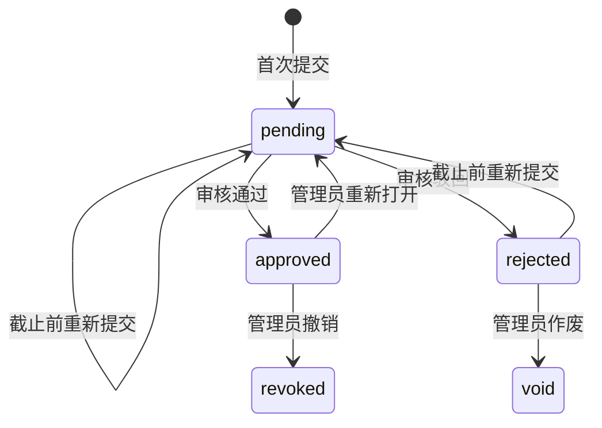
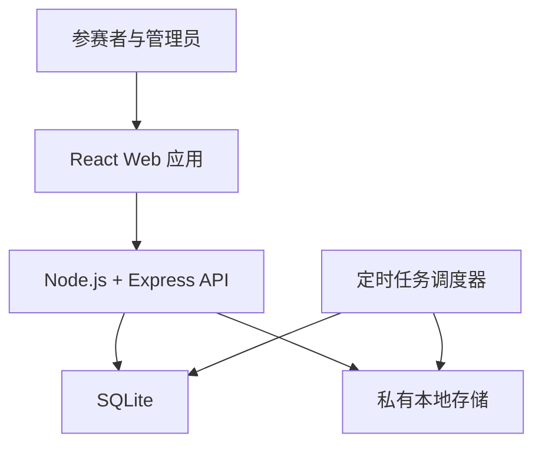

# CCME 国庆打卡平台产品与技术设计

> 文档版本：0.2  
> 文档状态：需求细化稿  
> 默认时区：Asia/Shanghai  
> 服务对象：北京大学化学与分子工程学院国庆打卡活动参与者及管理员  
> 活动介绍：[微信公众号推文](https://mp.weixin.qq.com/s/c_ZAXY7JJ4YtA6v1oJU2Qg)

## 1. 项目概述

本项目为北京大学化学与分子工程学院国庆打卡活动提供统一的线上平台，支持读书、单词背诵、运动健身三个赛道的每日打卡、证明材料上传、人工审核、积分计算和排行榜展示，并利用自动化流程减少名单整理、材料收集、打卡统计和排名计算中的重复劳动。

首期系统面向单次院内活动开发，同时在数据结构上保留复用能力，使管理员能够创建后续活动、调整日期和计分规则，无需修改代码。

## 2. 已确认的产品决策

| 项目 | 采用方案 |
| --- | --- |
| 参赛者账号 | 管理员批量导入参赛名单 |
| 计分方式 | 三个赛道的每日分值、积分上限和总榜权重**写在代码里**（`server/src/config/campaign.ts`），不做后台配置界面 |
| 每日提交规则 | 截止时间前允许修改或重新提交 |
| 截止后处理 | 普通用户不能补交；管理员可以进行带审计记录的补录或重新开放 |
| 排行榜更新 | 每天北京时间 06:00 生成一次排行榜快照 |
| 证明审核 | 管理员通过流水线式审核页面人工判断 |

## 3. 项目目标

系统需要实现以下目标：

1. 参赛者可以在手机或电脑浏览器中快速完成每日打卡，正常流程控制在一分钟以内。
2. 一个参赛者在同一活动日、同一赛道中只能拥有一条有效打卡记录。
3. 参赛者重新提交时保留历史版本，排行榜仅使用当前审核通过的版本。
4. 管理员可以连续审核材料，并通过键盘快捷键、预加载和自动跳转提高审核效率。
5. 排行榜采用定时快照，避免审核过程中排名持续变化。
6. 所有管理员操作均留下审计记录，积分变化可以追溯。
7. 证明图片采用私有存储，仅本人和管理员能够查看。
8. 活动结束后可以导出原始记录、审核结果和最终排行榜。

## 4. 首期范围

### 4.1 包含的功能

- 参赛名单批量导入
- 账号激活、登录、退出、修改密码
- 保持登录状态
- 三赛道每日打卡
- 图片上传、预览、替换和重新提交
- 个人打卡记录查询
- 审核通过、驳回和填写驳回原因
- 分赛道排行榜和总排行榜
- 每日排行榜快照
- 活动与计分规则的初始化（由 `npm run campaign:init` 从代码配置写入）
- 管理员补录、撤销审核和重新开放提交
- CSV 数据导出
- 操作审计日志

### 4.2 暂缓功能

以下功能不进入首期开发，可以作为后续迭代方向：

- 微信登录、北京大学统一身份认证
- 自动识别截图内容
- 基于 AI 的自动初审
- 微信、短信或邮件通知
- 队伍赛和组队打卡
- 社交动态、评论和点赞
- 原生 iOS、Android 应用
- 奖品发放和物流管理

## 5. 用户角色与权限

| 功能 | 参赛者 | 审核员 | 超级管理员 |
| --- | ---: | ---: | ---: |
| 查看活动信息 | ✓ | ✓ | ✓ |
| 提交个人打卡 | ✓ | 可同时作为参赛者 | 可同时作为参赛者 |
| 查看个人记录 | ✓ | ✓ | ✓ |
| 查看排行榜 | ✓ | ✓ | ✓ |
| 审核证明材料 |  | ✓ | ✓ |
| 查看全部参赛者记录 |  | ✓ | ✓ |
| 撤销审核结果 |  | 按权限配置 | ✓ |
| 导入参赛名单 |  |  | ✓ |
| 初始化活动及计分规则（改代码 + `campaign:init`） |  |  | ✓ |
| 补录和重新开放打卡 |  |  | ✓ |
| 导出数据 |  | 按权限配置 | ✓ |
| 管理管理员账号 |  |  | ✓ |
| 查看审计日志 |  |  | ✓ |

后端必须在每个受保护接口中验证权限，前端隐藏入口仅用于改善使用体验，不能充当权限控制手段。

## 6. 核心业务定义

### 6.1 活动

一次活动包含：

- 活动名称、介绍和封面
- 报名或账号激活时间
- 打卡开始日期和结束日期
- 每日提交截止时间
- 是否显示排行榜
- 排行榜更新时间
- 活动状态
- 三个赛道及各自计分规则

活动状态包括：

- `draft`：草稿，仅管理员可见
- `published`：已发布，允许账号激活
- `active`：打卡进行中
- `settling`：停止提交，正在完成最终审核
- `finished`：结果冻结
- `archived`：归档

### 6.2 活动日

活动日按照北京时间计算。默认每日有效提交区间为当天 `00:00:00—23:59:59`，具体截止时间由活动配置决定。

服务器统一保存 UTC 时间，同时为每条打卡记录单独保存 `activity_date`，防止服务器时区或夏令时设置影响业务日期。

`activity_date` 以 `YYYY-MM-DD` 文本形式保存，而不是时间戳。ISO 文本的字典序与时间序一致，因此在 SQLite 中既可以直接做范围查询，也能保证唯一约束按业务日期生效。中国不实行夏令时，所有截止时间按固定的 `+08:00` 偏移换算，不引入时区数据库依赖。

### 6.3 打卡槽位

一个打卡槽位由以下三项唯一确定：

- 参赛者
- 赛道
- 活动日

数据库必须保证 `(participant_id, track_id, activity_date)` 唯一。用户重新提交会产生新版本，不会创建第二个有效槽位。

### 6.4 打卡状态

| 状态 | 含义 | 是否计分 |
| --- | --- | ---: |
| `pending` | 已提交，等待审核 | 否 |
| `approved` | 审核通过 | 是 |
| `rejected` | 审核驳回 | 否 |
| `revoked` | 原审核结果被管理员撤销 | 否 |
| `void` | 记录因违规、重复或管理操作失效 | 否 |



每次重新提交都生成新的材料版本，并将打卡状态恢复为 `pending`。已通过的记录原则上不允许参赛者自行修改；确需修改时由管理员重新打开。

## 7. 参赛者使用流程

### 7.1 账号激活

管理员通过 CSV 导入学号、姓名、班级等信息。系统为每位参赛者生成一次性激活码，参赛者使用“学号＋激活码”完成首次激活，并设置个人密码。

激活码只保存哈希值，成功使用后立即失效。首次激活后，参赛者不能自行修改学号和姓名。

CSV 建议字段：

```text
student_id,name,class_name,phone_suffix,remark
```

其中 `student_id` 和 `name` 必填，其余字段可选。导入前显示校验结果，包括重复学号、空字段、格式错误和已有账号冲突；管理员确认后才正式写入。

### 7.2 登录与保持登录

- 用户使用学号和密码登录。
- 短期访问令牌用于接口访问。
- 长期刷新令牌保存在 `HttpOnly`、`Secure` Cookie 中。
- 用户主动退出、修改密码或管理员禁用账号后，相关刷新令牌全部失效。
- 连续登录失败需要触发限流，避免密码暴力尝试。
- 由于首期没有绑定邮箱，忘记密码由管理员生成一次性重置码。

### 7.3 主页面

主页面中心显示读书、单词背诵、运动健身三个赛道卡片。每张卡片展示：

- 赛道名称和图标
- 当日打卡状态
- 当日截止时间
- 当前活动累计有效天数
- 当前赛道积分
- 操作按钮
- 驳回原因或审核提示

卡片状态应同时通过颜色、图标和文字表达，保障色觉障碍用户也能识别。

| 状态 | 卡片提示 | 可用操作 |
| --- | --- | --- |
| 未开始 | 今日打卡尚未开放 | 无 |
| 可提交 | 今日尚未打卡 | 去打卡 |
| 待审核 | 已提交，等待审核 | 截止前可重新提交 |
| 已通过 | 今日打卡有效 | 查看详情 |
| 已驳回且未截止 | 显示驳回原因 | 重新提交 |
| 已驳回且已截止 | 今日打卡无效 | 查看详情 |
| 已截止未提交 | 今日未完成 | 无 |

页面顶部显示活动名称、日期、连续打卡概况和距离截止时间。截止倒计时只用于提示，服务器时间负责最终判定。

### 7.4 提交页面

提交页面需要展示：

- 赛道名称
- 当前日期
- 有效证明要求
- 允许上传的格式、数量和大小
- 图片选择或拖拽区域
- 上传预览
- 删除、重新选择和排序功能
- 必要的文字备注
- 提交按钮

首期默认规则：

- 每次允许上传 1—3 张图片
- 支持 JPEG、PNG、WebP
- 单张图片最大 10 MB
- 不接受仅修改扩展名的伪装文件
- 后端根据文件内容识别实际格式
- 提交接口需要防止重复点击产生重复记录
- 提交成功后返回主页面并显示“待审核”

各赛道可以分别配置证明说明，例如运动赛道要求截图中显示日期、运动类型和运动时长。

### 7.5 打卡记录

记录页面按照日期倒序展示，支持：

- 按赛道筛选
- 按状态筛选
- 查看提交时间
- 查看证明缩略图
- 查看审核时间和审核结果
- 查看驳回原因
- 在允许的时间内重新提交

历史版本默认折叠，仅在“提交历史”中展示。

### 7.6 排行榜

排行榜包含四个标签页：

- 读书榜
- 单词榜
- 健身榜
- 总榜

页面显示：

- 当前快照生成时间
- 已统计到的活动日期
- 名次
- 姓名或脱敏姓名
- 班级
- 有效天数
- 积分
- 当前用户所在行

如果公开真实姓名涉及隐私要求，可以配置为“姓氏＋名字末字”或其他脱敏形式。排行榜不展示学号、证明材料和驳回记录。

## 8. 管理员后台

### 8.1 后台首页

管理员首页显示：

- 参赛人数
- 今日提交数
- 待审核数
- 今日通过数和驳回数
- 各赛道提交率
- 距离下一次排行榜更新的时间
- 最近一次定时任务状态
- 异常任务或上传失败提醒

### 8.2 流水线审核页面

审核页面采用接近阅卷系统的布局：

- 左侧：待审核队列、筛选器和审核进度
- 中间：证明图片，可缩放、旋转、切换和全屏
- 右侧：参赛者、赛道、活动日、提交时间、历史记录及审核操作
- 底部：上一份、下一份、通过、驳回按钮

建议快捷键：

| 按键 | 操作 |
| --- | --- |
| `A` | 审核通过 |
| `R` | 打开驳回原因面板 |
| `Enter` | 确认驳回 |
| `J` / `K` | 下一份／上一份 |
| `+` / `-` | 放大／缩小 |
| `Esc` | 关闭弹窗或取消操作 |

驳回必须填写原因，可以从预设原因中选择并补充说明，例如：

- 截图日期不符合
- 无法识别打卡内容
- 运动时长或阅读量不足
- 图片重复
- 证明材料不完整
- 其他

系统应预加载下一份材料。两个管理员同时打开同一记录时，通过版本号或短期审核锁避免重复审核；后提交者若遇到记录状态已经变化，需要刷新后继续。

### 8.3 名单管理

管理员可以：

- 下载 CSV 模板
- 导入和预览名单
- 添加或禁用单个参赛者
- 重新生成激活码
- 重置密码
- 查看账号激活状态
- 导出参赛者信息

已有正式记录的参赛者不允许直接删除，可进行禁用或匿名化处理。

### 8.4 活动与规则配置

**不提供后台配置界面。以下内容全部定义在 `server/src/config/campaign.ts` 里，改动走代码评审与部署。**

- 活动日期（开始、结束）
- 每日开放和截止时间
- 三个赛道是否启用
- 每日基础分值
- 每日积分上限、活动积分上限
- 总榜权重
- 排行榜是否可见、更新时间
- 排名同分规则
- 图片数量和大小限制

各赛道的打卡说明定义在 `server/src/config/constants.ts` 的 `DEFAULT_TRACKS` 里，随种子脚本写入。

改完配置后运行 `npm run campaign:init` 应用：幂等，没有活动就创建，有一个就改成与代码一致，**并打印出改了哪些字段**。该动作会写入审计日志（操作人记为系统）。

做出这个取舍的理由：改分值、改权重会影响已经发布的排行榜，属于需要被看见的动作 —— 走代码就意味着它出现在一次提交、一次评审和一次部署里；而一个后台输入框改完之后，除了审计表里的一行谁也不会知道。代价是明确的：**活动中途要延期或调整截止时间也需要一次部署**。

由此，原先设想的「高风险操作影响提示」不再需要：没有运行期可改的规则，也就没有需要提醒的改动。

已经发布的排行榜不会因为规则变化而自动更新（§9.2）：快照是历史，重新计算需要显式触发（§8.5 的排行榜维护）。

### 8.5 异常处理

超级管理员可以：

- 为指定用户补录某日记录
- 临时重新开放某个打卡槽位
- 撤销审核结果
- 作废违规记录
- 重新运行指定日期的排行榜任务
- 冻结最终排行榜

所有异常操作必须填写原因，并写入审计日志。

## 9. 计分与排行榜规则

### 9.1 赛道积分

每个审核通过的打卡按照该赛道的规则产生积分。默认模型为：

```text
track_score = 所有审核通过记录的积分之和
total_score = Σ(track_score × overall_weight)
```

积分规则至少支持：

- 每次审核通过获得固定分值
- 每个赛道设置每日得分上限
- 每个赛道设置整个活动的积分上限
- 总榜中为每个赛道设置权重
- 管理员对特殊记录进行积分调整

人工调整不得直接修改原始积分字段，应单独建立调整记录，保存调整值、原因和操作人。

### 9.2 排行榜快照

每天北京时间 06:00 生成快照，默认统计截至前一日结束的所有已审核通过记录。

06:00 时仍处于待审核状态的记录暂不计分；后续审核通过后，会进入下一次快照。活动结束时，管理员需要先清空待审核队列，再生成并冻结最终榜单。

排行榜任务必须具备幂等性。同一活动、同一统计截止日期只能存在一个正式快照，重复执行应更新或重新生成该快照，不能产生重复结果。

### 9.3 同分处理

默认采用并列名次：积分相同的参与者显示相同名次。页面展示顺序可依次采用：

1. 总积分降序
2. 有效打卡总天数降序
3. 达到当前积分的时间升序
4. 系统内部稳定标识排序

奖项分配是否允许并列，需要在活动规则中单独确认。

## 10. 系统架构



### 10.1 前端

- TypeScript + React
- Vite 构建
- React Router 管理路由
- TanStack Query 管理服务器状态和缓存
- 组件库与自定义主题结合
- 响应式设计，优先保证手机端打卡体验
- 参赛者端的响应式断点是 **992px**：以下为手机形态（内容铺满、底部导航），
  以上为桌面形态（内容居中在一列 1040px 的壳里、顶部横条导航）。
  桌面下按内容性质分两类：浏览类页面（首页、排行榜、记录列表）用满宽度并分栏，
  阅读与表单类页面（提交、记录详情、我的）收敛到 720px 的可读行宽。
  手机端形态不因这次适配而改变
- 图片上传前显示预览和进度
- 管理后台优先适配桌面端

建议目录：

```text
frontend/src/
├── api/
├── components/
├── features/
│   ├── auth/
│   ├── campaign/
│   ├── checkin/
│   ├── leaderboard/
│   └── admin/
├── hooks/
├── layouts/
├── pages/
├── routes/
├── styles/
└── types/
```

### 10.2 后端

- Node.js 20+ 与 TypeScript
- Express 5
- SQLite（WAL 模式）
- Prisma ORM 与 Prisma Migrate 数据库迁移
- Zod 请求与响应校验
- 私有本地存储目录 + HMAC 签名临时地址
- 进程内定时任务调度器
- 结构化日志（pino）

SQLite 同一时刻只允许一个写入者，因此采用单进程部署：HTTP 服务与定时任务调度器运行在同一个 Node.js 进程内。任务互斥通过数据库中的锁表实现，同一任务只会有一个实例执行。数据库固定使用 SQLite，不引入其他数据库；任务数量或并发写入增加时，通过合并写入、批量提交与延长读缓存来缓解写入压力，而不是更换数据库。

由于 SQLite 不支持枚举类型，所有状态字段以字符串保存，取值范围由 TypeScript 常量与 Zod 枚举约束在应用层保证。

建议目录：

```text
server/src/
├── config/
├── core/
├── db/
├── jobs/
├── middleware/
├── modules/
├── services/
├── storage/
└── tests/
```

## 11. 数据模型

### 11.1 主要数据表

| 数据表 | 关键字段 |
| --- | --- |
| `users` | id、student_id、name、password_hash、role、status、password_changed_at |
| `activation_tokens` | user_id、token_hash、expires_at、used_at |
| `refresh_sessions` | user_id、token_hash、expires_at、revoked_at、device_info |
| `campaigns` | name、description、timezone、start_date、end_date、daily_deadline、status |
| `tracks` | slug、name、description、icon |
| `campaign_tracks` | campaign_id、track_id、daily_points、daily_cap、campaign_cap、overall_weight |
| `campaign_participants` | campaign_id、user_id、class_name、joined_at、status |
| `checkin_entries` | participant_id、track_id、activity_date、status、current_revision_id |
| `submission_revisions` | entry_id、revision_number、note、submitted_at、submitted_by |
| `submission_assets` | revision_id、object_key、mime_type、size、width、height、sha256 |
| `review_actions` | entry_id、revision_id、reviewer_id、action、reason、created_at |
| `score_adjustments` | participant_id、track_id、points_delta、reason、operator_id |
| `leaderboard_snapshots` | campaign_id、cutoff_date、generated_at、status、is_final |
| `leaderboard_rows` | snapshot_id、participant_id、track_id、rank、score、valid_days |
| `audit_logs` | actor_id、action、target_type、target_id、before_data、after_data、request_id |
| `job_runs` | job_name、started_at、finished_at、status、processed_count、error_summary |
| `job_locks` | name、locked_at、expires_at |
| `import_batches` | campaign_id、file_sha256、status、summary、committed_at |

### 11.2 关键约束与索引

- `users.student_id` 唯一
- `(campaign_id, user_id)` 唯一
- `(participant_id, track_id, activity_date)` 唯一
- `(entry_id, revision_number)` 唯一
- `(campaign_id, cutoff_date)` 对正式排行榜快照唯一
- 为待审核队列建立 `(status, submitted_at)` 索引
- 为个人记录建立 `(participant_id, activity_date)` 索引
- 为审核行为和管理员操作保留追加式日志
- 排行榜 `overall` 总榜行使用固定的哨兵值作为 `track_id`，避免 SQLite 中 `NULL` 互不相等导致唯一约束失效
- SQLite 启用 WAL 模式和 `busy_timeout`，写入冲突时短暂重试而不是立即报错

## 12. API 设计

API 统一使用 `/api/v1` 前缀。

### 12.1 认证

| 方法 | 路径 | 功能 |
| --- | --- | --- |
| POST | `/auth/activate` | 使用学号和激活码激活账号 |
| POST | `/auth/login` | 登录 |
| POST | `/auth/refresh` | 刷新访问令牌 |
| POST | `/auth/logout` | 退出并撤销当前会话 |
| POST | `/auth/change-password` | 修改密码 |
| GET | `/users/me` | 获取当前用户 |

### 12.2 活动与打卡

| 方法 | 路径 | 功能 |
| --- | --- | --- |
| GET | `/campaigns/current` | 获取当前活动和赛道规则 |
| GET | `/checkins/today` | 获取今日三个赛道状态 |
| GET | `/checkins` | 查询个人打卡记录 |
| GET | `/checkins/{entry_id}` | 查看打卡详情和版本 |
| POST | `/checkins` | 创建或重新提交打卡 |
| GET | `/checkins/{entry_id}/assets/{asset_id}` | 获取有权限的临时图片地址 |

`POST /checkins` 使用 `multipart/form-data`，需要提供赛道、活动日期、备注、图片和幂等键。

### 12.3 排行榜

| 方法 | 路径 | 功能 |
| --- | --- | --- |
| GET | `/leaderboards/latest` | 获取最新总榜 |
| GET | `/leaderboards/latest?track=reading` | 获取指定赛道榜 |
| GET | `/leaderboards/me` | 获取当前用户排名和附近名次 |

### 12.4 管理后台

| 方法 | 路径 | 功能 |
| --- | --- | --- |
| POST | `/admin/participants/import/preview` | 校验并预览名单 |
| POST | `/admin/participants/import/commit` | 正式导入名单 |
| GET | `/admin/reviews/queue` | 获取审核队列 |
| POST | `/admin/reviews/{entry_id}/approve` | 审核通过 |
| POST | `/admin/reviews/{entry_id}/reject` | 审核驳回 |
| POST | `/admin/checkins/{entry_id}/reopen` | 重新开放 |
| POST | `/admin/checkins/manual` | 管理员补录 |
| POST | `/admin/leaderboards/rebuild` | 重算排行榜 |
| POST | `/admin/leaderboards/freeze` | 冻结最终榜单 |
| GET | `/admin/exports/checkins.csv` | 导出打卡数据 |
| GET | `/admin/audit-logs` | 查询审计日志 |

### 12.5 错误响应

所有接口使用统一错误格式：

```json
{
  "code": "CHECKIN_CLOSED",
  "message": "今日打卡已经截止",
  "request_id": "req_xxx",
  "details": {}
}
```

前端根据稳定的 `code` 判断交互方式，不能依赖中文错误文本。

## 13. 文件存储与安全

- 图片存入私有存储（首期为本机私有目录，通过存储接口抽象，后续可替换为 S3 兼容对象存储），数据库只保存对象键和元数据。
- 对象键使用随机标识生成，不能包含姓名或学号。
- 图片访问使用短期签名地址。
- 参赛者只能访问自己的材料，管理员按角色访问全部材料。
- 后端检查 MIME 类型、文件头、尺寸和文件大小。
- 图片成功解码后再接受上传，无法解码的文件直接拒绝。
- 默认删除 EXIF 等可能包含位置和设备信息的元数据。
- 相同文件的 SHA-256 可以用于提示疑似重复证明，但不能直接作为违规结论。
- 日志中不得记录密码、令牌、激活码或签名图片地址。
- 密码使用 Argon2id 等适合密码存储的算法处理。
- 所有生产流量强制使用 HTTPS。
- 管理员敏感操作需要重新验证权限并写入审计日志。

## 14. 定时任务

系统至少需要以下任务：

| 时间或频率 | 任务 |
| --- | --- |
| 每日 06:00 | 生成前一日截止的排行榜快照 |
| 每小时 | 清理失效的登录会话和激活码 |
| 每日低峰期 | 清理没有关联到正式提交的临时上传 |
| 活动状态边界 | 自动切换活动状态 |
| 管理员触发 | 重算排行榜、生成最终榜单和导出文件 |

每次任务需要记录开始时间、结束时间、执行状态、处理数量和错误摘要。排行榜生成失败时保留上一份有效快照，并在后台首页显示警告。

## 15. 非功能要求

首期容量基线暂定为：

- 参赛者不超过 1000 人
- 每日图片提交不超过 5000 张
- 峰值并发用户不超过 100 人
- 普通 JSON 接口的 P95 响应时间低于 500 ms
- 排行榜查询响应时间低于 1 s
- 支持最新版主流桌面和移动浏览器
- 首期单进程部署，SQLite 使用 WAL 模式，写入串行执行
- 关键数据库每日备份（SQLite 使用 `VACUUM INTO` 生成一致性快照）
- 数据库恢复能力在上线前进行一次实际演练

上传速度受用户网络和对象存储影响，应显示实时进度，并允许失败后重新上传。

## 16. 测试与验收标准

上线前至少完成以下场景：

1. 名单中的学生可以激活账号，名单外的学号无法激活。
2. 同一学号无法重复创建账号。
3. 参赛者可以分别完成三个赛道的当日打卡。
4. 同一赛道当日重新提交后只有最新版本进入审核队列。
5. 截止时间到达后，普通用户无法提交或重新提交。
6. 驳回原因能够正确显示给参赛者。
7. 审核通过的记录正确计分，驳回和待审核记录不计分。
8. 两名管理员同时审核同一记录时不会产生互相覆盖的结果。
9. 06:00 定时任务重复执行不会生成重复快照。
10. 活动日期边界和北京时间零点附近的记录归属正确。
11. 参赛者无法读取他人的证明图片。
12. 审核员无法修改活动计分规则。
13. 修改密码后已有长期会话全部失效。
14. 管理员补录、撤销和积分调整均产生审计记录。
15. 最终冻结后，普通审核操作不能继续改变最终排行榜。
16. CSV 导出的人数、记录数和积分与数据库统计一致。

## 17. 开发里程碑

### 阶段一：规则确认与工程初始化

- 确认活动日期、截止时间和各赛道证明要求
- 建立前后端项目
- 配置数据库迁移、日志和测试环境
- 完成用户、角色和活动基础模型

### 阶段二：账号与参赛者功能

- 名单导入
- 账号激活和登录
- 主页面
- 三赛道提交
- 个人打卡记录

### 阶段三：审核后台

- 待审核队列
- 图片查看
- 通过和驳回
- 审核冲突控制
- 补录和重新开放
- 审计日志

### 阶段四：计分与排行榜

- 计分规则（定义在代码里，见 §8.4）
- 分赛道榜和总榜
- 06:00 定时快照
- 重算和最终冻结
- CSV 导出

### 阶段五：安全、测试与部署

- 权限测试
- 文件安全检查
- 时区和截止时间测试
- 数据备份
- 压力测试
- 上线演练和管理员培训

## 18. 上线前仍需确认

1. 活动的准确开始日期、结束日期和每日截止时间。
2. 三个赛道分别需要上传什么证明，是否需要文字备注。
3. 每个赛道的每日分值、积分上限和总榜权重（确认后填入 `server/src/config/campaign.ts`）。
4. 同分时奖项如何分配。
5. 排行榜显示真实姓名、班级还是脱敏姓名。
6. 管理员和审核员预计人数及权限划分。
7. 账号激活码通过什么渠道发放。
8. 证明图片需要保留多久，活动结束后是否统一删除。
9. 预计参赛人数和每日最高提交量。
10. 部署服务器、域名、对象存储和备份位置。
11. 活动结束后仍处于待审核状态的记录如何处理。
12. 是否需要参赛者在首次登录时确认隐私说明和活动承诺。
